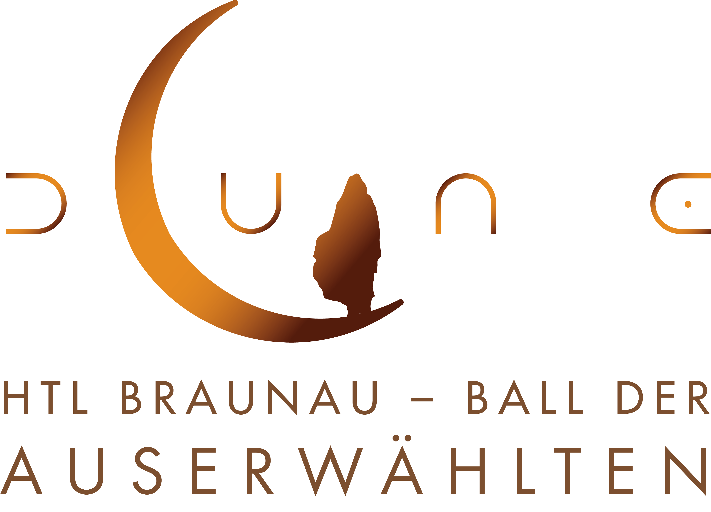
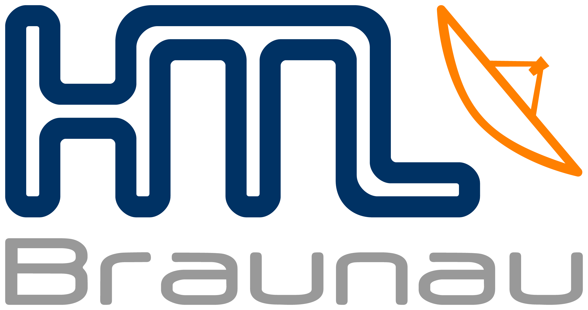

# HTL Ball 2026 - Kartenverkauf

**DUNE - Ball der Auserwählten**

**Moderne Webplattform für den HTL-Ball mit Kartenverkauf und effizientem Backend-Management**

**Entwickelt von:**

[@michelroegl-brunner](https://github.com/michelroegl-brunner) / [@raphaelz070201](https://github.com/raphaelz070201)

**Made with ❤️ for HTL Braunau**

